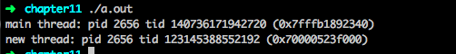
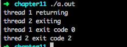
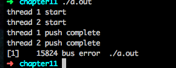

# 线程  

## 线程的概念  

典型的UNIX进程可以看成只有一个控制线程；一个进程在某一时刻只能做一件事情。有了多个控制线程后，在程序设计时就可以把进程设计成在某一时刻做不止一件事，每个线程处理各自独立的任务。这种方法有很多好处  
1. 简化处理异步事件的代码
2. 分解复杂的问题提高整个程序的吞吐量
3. 使用多线程改善响应时间  

每个线程都包含有表示执行环境所必须的信息。其中包括进程中标识线程的线程ID、一组寄存器值、栈、调度优先级和策略、信号屏蔽字、errno变量以及线程私有数据。  
## 线程标识

每个线程都有一个线程ID。但跟进程不一样，进程ID在整个系统中是唯一的，线程ID只有在它所属的进程上下文中才有意义。  


线程ID通过使用pthread_t数据类型表示，必须要使用一个函数对两个线程ID进行比较。  
```
#include <pthread.h>
int pthread_equal(pthread_t tid1, pthread_t tid2);
// 相等返回非零，不同返回0
```

线程通过调用pthread_self函数获得自身的线程ID  
```
#include <pthread.h>
pthread_t pthread_self(void);
```

## 线程创建

新增的线程可以通过调用pthread_create函数创建。  
```
#include <pthread.h>
int pthread_create(pthread_t *restrict tidp, 
                   const pthread_attr_t *restrict attr,
                   void *(*start_rtn)(void *), void *restrict arg);
//成功返回0，失败返回错误编号
```
* 当pthread_create成功返回时，新创建线程的线程ID会被设置成tidp指向的内存单元。attr用于定制各种不同的线程属性(第12章介绍)，设置为NULL，表示创建一个具有默认属性的线程。
* 新创建的线程从start_rtn函数的地址开始执行，该函数只有一个无类型指针参数arg。如果有多个参数传递，需要把这些参数放到一个结构中，然后传递这个结构的地址进去。
* 线程创建时不能保证执行顺序  

如下程序创建了一个线程，打印了进程ID、新线程的线程ID以及初始线程的线程ID。 

```
#include "apue.h"
#include <pthread.h>

pthread_t ntid;
void printids(const char *s){
    pid_t   pid;
    pthread_t tid;
    pid = getpid();
    tid = pthread_self();
    printf("%s pid %lu tid %lu (0x%lx)\n",s,(unsigned long)pid, (unsigned long)tid, (unsigned long)tid);
}

void * thr_fn(void *arg){
    printids("new thread:");
    return ((void *)0);
}

int main()
{
    int err;
    err = pthread_create(&ntid, NULL, thr_fn, NULL);
    if(err !=0 )
        err_exit(err, "can't create thread");
    printids("main thread:");
    sleep(1);
    exit(0);
}
```

运行结果如图所示  
  
可以看到打印出了相同的进程ID，但在mac系统上线程ID不在相同地址段范围  

## 线程终止

如果进程中的任意线程调用了exit、`_Exit`或者`_exit`，那么整个进程就会终止。  
单个线程可以通过3种方式退出，可以在不终止整个进程的情况下，停止它的控制流。 
1. 线程可以简单的从启动例程中返回，返回值是线程的退出码。
2. 线程可以被同一进程中的其他线程取消。
3. 线程调用pthread_exit。

```
#include <pthread.h>
void pthread_exit(void *rval_ptr);
```

rval_ptr参数是一个无类型指针，进程中的其他线程可以通过调用pthread_join函数访问到这个指针

```
#include <pthread.h>
int pthread_join(pthread_t thread, void **rval_ptr);
//成功返回0，失败返回错误编号
```

* 调用线程将一直阻塞，直到指定的线程调用pthread_exit、从启动例程中返回或者被取消。如果线程简单地从它的启动例程返回，rval_ptr就包含返回码。如果线程被取消，由rval_ptr指定的内存单元就设置为PTHREAD_CANCELED。  
* 通过调用pthread_join自动把线程置于分离状态，这样资源就可以恢复。如果线程已经处于分离状态，pthread_join就会调用失败，返回EINVAL  

如下程序展示了如何获取已经终止线程的退出码  

```
#include "apue.h"
#include <pthread.h>

void *thr_fn1(void *arg)
{
    printf("thread 1 returning\n");
    return((void *)0);
}
void *thr_fn2(void *arg)
{
    printf("thread 2 exiting\n");
    pthread_exit((void *)2);
}

int main(void)
{
    int         err;
    pthread_t   tid1,tid2;
    void        *tret;
    err = pthread_create(&tid1,NULL,thr_fn1,NULL);
    if (err != 0)
        err_exit(err, "can't create thread 1");
    err = pthread_create(&tid2,NULL,thr_fn2,NULL);
    if (err != 0)
        err_exit(err, "can't create thread 2");
    err = pthread_join(tid1, &tret);
    if(err != 0)
        err_exit(err, "can't join with thread 1");
    printf("thread 1 exit code %ld\n",(long)tret);
    err = pthread_join(tid2, &tret);
    if (err != 0)
        err_exit(err, "can't join with thread 2");
    printf("thred 2 exit code %ld\n",(long)tret);
    exit(0);
}
```
运行结果如下:  
  

线程可以通过调用pthread_cancel函数来请求取消同一进程中的其他线程  

```
#include <pthread.h>
int pthread_cancel(pthread_t tid);
//成功返回0，失败返回错误编号
```

pthread_cancel并不等待线程终止，它仅仅提出请求  

线程可以安排它退出时需要调用的函数(线程清理处理程序)。一个线程可以建立多个清理处理程序。处理程序记录在栈中，他们的执行顺序与他们注册时相反。  

```
#include <pthread.h>
void pthread_cleanup_push(void (*rtn)(void *), void *arg);
void pthread_cleanup_pop(int execute);
```

当线程执行以下动作时，清理函数rtn是由pthread_cleanup_push函数调度的，调用时只有一个参数arg:  
* 调用pthread_exit时
* 响应取消请求时
* 用非零execute参数调用pthread_cleanup_pop时  

如果execute参数设置为0，清理函数将不被调用。  

如下程序是使用线程清理处理程序的例子  

```
#include "apue.h"
#include <pthread.h>

void cleanup(void *arg)
{
    printf("cleanup: %s\n",(char *)arg);
}

void *thr_fn1(void *arg)
{
    printf("thread 1 start\n");
    pthread_cleanup_push(cleanup, "thread 1 first handler");
    pthread_cleanup_push(cleanup, "thread 1 second handler");
    printf("thread 1 push complete\n");
    if (arg)
        return ((void *)1);
    pthread_cleanup_pop(0);
    pthread_cleanup_pop(0);
    return ((void *)1);
}

void *thr_fn2(void *arg)
{

    printf("thread 2 start\n");
    pthread_cleanup_push(cleanup, "thread 2 first handler");
    pthread_cleanup_push(cleanup, "thread 2 second handler");
    printf("thread 2 push complete\n");
    if (arg)
        return ((void *)2);
    pthread_cleanup_pop(0);
    pthread_cleanup_pop(0);
    return ((void *)2);

}

int main(int argc, const char *args[])
{
    int             err;
    pthread_t       tid1,tid2;
    void            *tret;
    err = pthread_create(&tid1, NULL, thr_fn1, (void*)1);
    if (err !=0 )
        err_exit(err, "can't create thread 1");
    err = pthread_create(&tid2, NULL, thr_fn2, (void*)1);
    if (err !=0 )
        err_exit(err, "can't create thread 2");
    err = pthread_join(tid1, &tret);
    if (err !=0 )
        err_exit(err, "can't join with thread 1");
    printf("thread 1 exit code %ld\n", (long)tret);
    err = pthread_join(tid2, &tret);
    if (err !=0 )
        err_exit(err, "can't join with thread 2");
    printf("thread 2 exit code %ld\n", (long)tret);
    exit(0);
}
```  

运行结果如下  
  

mac 下会产生core文件。这是因为在mac平台上，pthread_cleanup_push是用宏实现的，而宏把某些上下文存放到栈上。当线程1在调用pthread_cleanup_push和调用pthread_cleanup_pop之间返回时，栈已被改写，而这个平台在调用清理处理程序时就用了这个被改写的上下文。在Single UNIX Specification中，函数如果在调用pthread_cleanup_push和pthread_cleanup_pop之间返回，会产生未定义行为。唯一的可移植方法是调用pthread_exit.  

## 线程同步  

当多个控制线程共享相同的内存时，需要确保每个线程看到一致的数据视图。变量只读的时候不会出现一致性问题，但是当一个线程可以修改变量，其他线程可以读或可以修改的时候，就需要对这些线程进行同步。  

### 互斥量

可以使用pthread的互斥接口来保护数据，确保同一时间只有一个线程访问数据。互斥量(mutex)从本质上说是一把锁，在访问共享资源前对互斥量进行设置(加锁)，在访问完成后释放(解锁)互斥量，对互斥量进行加锁以后，任何其他试图再次对互斥量加锁的线程都会被阻塞直到当前线程释放该互斥锁。如果释放互斥量时有一个以上的线程阻塞，那么该锁上的阻塞线程都会变成可运行状态，第一个变为运行的线程就可以对互斥量加锁，其他线程就会看到互斥量依然是锁着的，只能回去再次等待它重新变为可用。  

互斥变量是用pthread_mutex_t数据类型表示的。在使用互斥变量以前，必须首先对它进行初始化，可以把它设置为常量PTHREAD_MUTEX_INITIALIZER(只适用于静态分配的互斥量)，也可以通过调用pthread_mutex_init函数进行初始化。如果动态分配互斥量(例如，通过调用malloc函数)，在释放内存前需要调用pthread_mutex_destroy。  

```
#include <pthread.h>
int pthread_mutex_init(pthread_mutex_t *restrict mutex,
                       const pthread_mutexattr_t *restrict arrt);

int pthread_mutex_destory(pthread_mutex_t *mutex);
//成功返回0，失败返回错误编号
```  

要用默认的属性初始化互斥量，只需把attr设为NULL。  
对互斥量进行加锁，需要调用pthread_mutex_lock。如果互斥量已经上锁，调用线程将阻塞直到互斥量被解锁。对互斥量解锁，需要调用pthread_mutex_unlock  

```
#include <pthread.h>
int pthread_mutex_lock(pthread_mutex_t *mutex);
int pthread_mutex_trylock(pthread_mutex_t *mutex);
int pthread_mutex_unlock(pthread_mutex_t *mutex);
//成功返回0，错误返回错误编号
```
如果线程不希望被阻塞，它可以使用pthread_mutex_trylock尝试对互斥量进行加锁。如果调用pthread_mutex_trylock是互斥量处于未锁住状态，那么pthread_mutex_trylock将锁住互斥量，不会出现阻塞直接返回0，否者pthread_mutex_trylock就会失败，并返回EBUSY。  

```

```

### 避免死锁  

#### 死锁产生的原因  

1. 互斥条件
2. 不可剥夺条件
3. 请求和保持条件
4. 循环等待条件

#### 死锁预防
1. 破坏“不可剥夺”条件
2. 破坏“请求和保持”条件
3. 破坏“循环等待”条件

#### 死锁避免

银行家算法 避免死锁

### 函数pthread_mutex_timedlock  

当线程试图获取一个已加锁的互斥量时，pthread_mutex_timedlock互斥量原语允许绑定线程阻塞时间。pthread_mutex_timedlock函数与pthread_mutex_lock基本等价，但是在达到超时时间值时，pthread_mutex_timedlock不会对互斥量进行加锁，而是返回错误码ETIMEDOUT。  

```
#include <pthread.h>
#include <time.h>
int pthread_mutex_timedlock(pthread_mutex_t *restrict mutex,
                            const struct timespec *restrict tsptr);

//成功返回0，失败返回错误编号
```

如下程序是使用pthread_mutex_timedlock避免永久阻塞  


```
#include "apue.h"
#include <pthread.h>

int main(void)
{
    int  err;
    struct timespec tout;
    struct tm *tmp;
    char buf[64];
    pthread_mutex_t lock = PTHREAD_MUTEX_INITIALIZER;


    pthread_mutex_lock(&lock);
    printf("mutex is locked\n");
    clock_gettime(CLOCK_REALTIME, &tout);
    tmp = localtime(&tout.tv_sec);
    strftime(buf, sizeof(buf),"%f",tmp);
    printf("current time is %s\n", buf);
    tout.tv_sec += 10;

    err = pthread_mutex_timedlock(&lock, &tout);
    clock_gettime(CLOCK_REALTIME, &tout);
    tmp = localtime(&tout.tv_sec);
    strftime(buf, sizeof(buf), "%r", tmp);
    printf("the time is now %s\n", buf);
    if (err == 0)
        printf("mutex locked again!\n");
    else
        printf("can't lock mvtex aggin: %s\n", strerror(err));
    exit(0);
}
```  

### 读写锁

读写锁(reader-writer lock)与互斥量类似，不过读写锁允许更高的并行性。互斥量要么是锁住状态，要么就是不加锁状态，而且一次只有一个线程可以对其加锁。读写锁有3种状态：  
1. 读模式下加锁
2. 写模式下加锁
3. 不加锁状态

一次只有一个线程可以占有写模式的读写锁，但是多个线程可以同时占有读模式的读写锁。 

* 写加锁状态，锁被解锁前，所有试图对这个锁加锁的线程都会被阻塞。
* 读加锁状态，所有以读模式对它进行加锁的线程都可以获得访问权，以写模式对它进行加锁的线程都会阻塞，直到所有线程释放它们的读锁为止。  

读写锁适合对数据结构读的次数远大于写的情况。  

读写锁也叫共享互斥锁。当读模式时，可以说是以共享模式锁住的。当写模式时，可以锁是以互斥模式锁住的。  

与互斥量相比，读写锁在使用之前必须初始化，在释放它们底层的内存之前必须销毁。  

```
#include <pthread.h>
int pthread_rwlock_init(pthread_mutex_t *restrict rwlock,
                        const pthread_rwlockattr_t *restrict attr);
int pthread_rwlock_destroy(pthread_rwlock_t *rwlock);
//成功返回0，失败返回错误编号
```

在释放读写锁占用的内存之前，需要调用pthread_rwlock_destroy做清理工作，如果pthread_rwlock_init为读写锁分配了资源，pthread_rwlock_destroy将释放这些资源。如果在调用pthread_rwlock_destroy之前就释放了读写锁占用的空间，那么分配给这个锁的资源就会丢失。  

要在读模式下锁定读写锁，需要调用pthread_rwlock_rdlock。要在写模式下锁定读写锁，需要调用pthread_rwlock_wrlock。可以调用pthread_rwlock_unlock进行解锁  

```
#include <pthread.h>
int pthread_rwlock_rdlock(pthread_rwlock_t *rwlock);
int pthread_rwlock_wrlock(pthread_rwlock_t *rwlock);
int pthread_rwlock_unlock(pthread_rwlock_t *rwlock);
```  

读写锁原语的条件版本  
```
#include <pthread.h>
int pthread_rwlock_tryrdlock(pthread_rwlock_t *rwlock);
int pthread_rwlock_trywrlock(pthread_rwlock_t *rwlock);
//成功返回0，失败返回错误编号
```

### 带有超时的读写锁
超时的读写锁加锁函数，使应用程序在获取读写锁时避免陷入永久阻塞状态。  

```
#include <pthread.h>
#include <time.h>
int pthread_rwlock_timedrdlock(pthread_rwlock_t *restrict rwlock,
                              const struct timespec *restrict tsptr);

int pthread_rwlock_timedwrlock(thread_rwlock_t *restrict rwlock,
                              const struct timespec *restrict tsptr);
```

### 条件变量  

条件变量是线程可用的另一种同步机制。条件变量给多个线程提供了一个汇合的场所，条件变量与互斥量一起使用，允许线程以无竞争的方式等待特定的条件发生。  
条件本身是由互斥量保护的。线程在改变条件状态之前必须首先锁住互斥量。其他线程在获得互斥量之前不会察觉到这种改变，因为互斥量必须在锁定以后才能计算条件。  
在使用前，先初始化，使用pthread_cond_init函数进行初始化。  
pthread_cond_destroy函数对条件变量进行反初始化  

```
#include <pthread.h>
int pthread_cond_init(pthread_cond_t *restrict cond,
                      const pthread_condattr_t *restrict attr);

int pthread_cond_destroy(pthread_cond_t *cond);
//成功返回0，失败返回错误码
```

使用pthread_cond_wait等待条件变量变为真。 

```
#include <pthread.h>
int pthread_cond_wait(pthread_cond_t *restrict cond,
                      pthread_mutex_t *restrict mutex);

int pthread_cond_timedwait(pthread_cond_t *restrict cond,
                      pthread_mutex_t *restrict mutex,
                      const struct timespec *restrict tsptr);
```

有两个函数可以通知线程已经满足。  

```
#include <pthread.h>
int pthread_cond_signal(pthread_cond_t *cond);
int pthread_cond_broadcast(pthread_cond_t *cond);
```

pthread_cond_signal函数至少能唤醒一个等待该条件的线程，而pthread_cond_broadcast能唤醒所有的。  

### 自旋锁  

自旋锁与互斥量类似，但它不是通过休眠使进程阻塞，而是在获取锁之前一直处于忙等阻塞状态，自旋锁可以用于以下状况：  
1. 锁被持有的时间短，而且线程并不希望在重新调度上花费太多成本。

自旋锁通常作为底层原语用于实现其他类型的锁。  
自旋锁用在非抢占式内核中是非常有用的  
自选锁的接口与互斥量的接口类似  

```
#include <pthread.h>
int pthread_spin_init(pthread_spinlock_t *lock, int pshared);
int pthread_spin_destroy(pthread_spinlock_t *lock);
```

可以使用pthread_spin_lock或pthread_spin_trylock对自旋锁进行加锁，前者在获取锁之前一直自旋，后者如果不能获得锁，就立即返回EBUSY错误。注意：pthread_spin_trylock不能自旋，不管以何种方式加锁，自旋锁都可以调用pthread_spin_unlock函数解锁。 

```
#include <pthread.h>
int pthread_spin_lock(pthread_spinlock_t *lock);
int pthread_spin_trylock(pthread_spinlock_t *lock);
int pthread_spin_unlock(pthread_spinlock_t *lock);
```

### 屏障  
屏障(barrier)是用户协调多个线程并行工作的同步机制。
