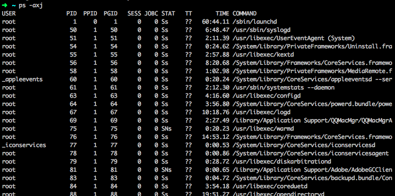
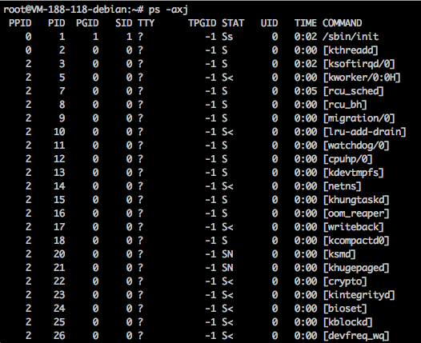
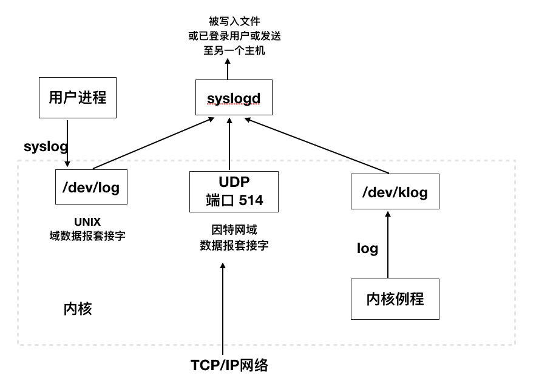

## 前言  
守护进程(daemon)是在系统引导装入时启动，仅在系统关闭时才终止。守护进程是在后台运行的。  
## 守护进程特征  
在命令行下输入 ps -axj(bsd系统)  查看系统中各个进程的状态。  

  

父ID为0的个进程通常是内核进程，内核进程存在于系统的整个生命周期，他们以超级用户特权运行，无控制终端，无命令行。  


在ps的输出中，内核守护进程的名字出现在方括号中。  

  

可以看到Linux使用了kthreadd的特殊内核进程来创建其他的内核进程，所以其他内核进程的父进程为2 也就是kthreadd进程。对于需要在进程上下文执行工作但却不被用户层进程上下文调用的每一个内核组件，通常有它自己的内核守护进程。如在Linux中。  

* kswapd 内存换页守护进程。它支持虚拟内存子系统在经过一段时间后将脏页面慢慢写会磁盘。
* flush  守护进程在可用内存达到设置的最小阀值时将脏页面冲洗至磁盘。同时它还定期将脏页面冲洗会磁盘防止数据丢失。
* sync_supers 定期将文件系统元数据冲洗至磁盘。
* jbd 帮助实现了ext4文件系统中的日志功能。

----

* 进程1通常是init进程，它是系统守护进程，主要负责启动各运行层次特定的系统服务。  
* rpcbind守护进程提供将RPC程序号映射为网络端口号的服务。  
* rsyslogd守护进程可以被由管理员启用的将系统日志记录的任何程序使用  
* inetd守护进程。侦听系统网络接口，以便取得来自网络的对各种网络服务进程的请求  
* nfsd、nfsiod、lockd、rpciod、rpc.idmapd、rpc.statd、rpc.mountd提供了网络文件系统的支持。  


## 编写规则  
编写一个守护进程需要遵循一些规则，防止产生不必要的交互。  
1. 调用umask将文件模式创建屏蔽字设置为一个已知值通常为0
2. 调用fork，然后父进程exit
3. 调用setsid创建一个新会话
4. 当前工作目录更改为根目录
5. 关闭不需要的文件描述符
6. 某些守护进程打开/dev/null 使其具有文件描述符0、1、2


## 出错记录
守护进程出错处理，大多数守护进程都使用 BSD的syslog设施。  

  


 有3种产生日志消息的方式  
 
 1. 内核例程可以调用log函数。
 2. 大多数用户进程(守护进程)调用syslog(3)函数来产生日志消息，
 3. 无论一个用户进程是在此主机上，还是在通过TPC/IP网络连接到此主机的其他主机上，都可以将日志消息发送到UDP的514端口。  


 通常，syslogd守护进程读取所有3种格式的日志消息。启动时读取一个配置文件，通常是/etc/syslogd.conf该文件决定了不同种类的消息应送到何处。  

 syslog设施的接口是syslog函数  

 ```
 #include <syslog.h>
 void openlog(const char *ident, int option, int facility);
 void syslog(int priority, const char *format, ...);
 void closelog(void);
 int setlogmask(int maskpri);
 ```


 ## 单实例守护进程

 某些守护进程会实现为，在任意时刻只运行该守护进程的一个副本。对于cron守护进程而言，如果有多个实例运行，那么每个副本都可能试图开始某个预定的操作，会造成重复执行，这可能会出错。  

 如果守护进程需要访问一个设备，而该设备驱动程序有时会阻止想要多次打开/dev 目录下相应设备节点的尝试。这就限制了在一个时刻只能运行守护进程的一个副本。但如果没有这种设备可供使用，那么就需要自行处理。   

 文件和记录锁机制为一种方法提供了基础，该方法保证一个守护进程只有一个副本在运行。如果每一个守护进程创建一个固定名字的文件，并在该文件的整体上加一把写锁，那么只允许创建一把这样的锁。在此之后创建写锁的尝试都会失败，这向后续进程副本指明已有一个副本正在运行。  


 ## 守护进程惯例

 在UNIX系统中，守护进程遵循以下通用惯例  

 * 若守护进程使用锁文件，那么该文件通常存储在/var/run目录中。
 * 若守护进程支持配置选项，那么配置文件一般位于/etc下，如/etc/syslog.conf  
 * 守护进程可以由命令行启动，但通常它们是由系统启动脚本之一启动的`/etc/rc*或/etc/init.d/*`。
 * 配置文件一般只在启动时读取，如果更改配置文件，就要重启进程。

