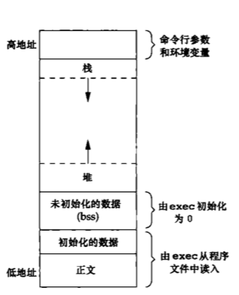

# 进程环境
主要介绍了如下内容:
* 当程序执行时，其main函数是如何被调用的；
* 命令行参数是如何传递给应用程序的；
* 典型的存储空间布局是什么样式；
* 如何分配另外的存储空间；
* 进程如何使用环境变量；
* 进程的各种不同终止方式等
## 介绍
1. main函数:  

    c语言总是从main函数启动的

    ```
    int main(int argc, char *argv[])
    ```
    参数:  
    - `argc`: 命令行参数数目
    - `argv`: 指向各个指针构成的数组  

    当内核执行C语言程序时，在调用main函数前先调用一个特殊的启动例程  
    启动例程:  
    如果目标文件是由C代码编译生成的，用gcc做链接就没错了，整个程序的入口点是crt1.o中提供的_start，它首先做一些初始化工作（以下称为启动例程，Startup Routine），然后调用C代码中提供的main函数。所以，以前我们说main函数是程序的入口点其实不准确，`_start`才是真正的入口点，而main函数是被_start调用的。


2. 进程终止

    有8种方式使进程终止，其中5种是正常终止:
    - 从main函数返回
    - 调用exit
    - 调用_exit和_Exit
    - 最后一个线程从其启动例程返回
    - 从最后一个线程调用pthread_exit  

    异常终止有3种:
    - 调用abort
    - 接到一个信号
    - 最后一个线程对取消请求做出相应
    1. 退出函数
    3个函数用于正常终止一个程序,`_exit`和_Exit立即进入内核，exit则先执行一些清理处理，然后返回内核。

    ```
    #include <stdio.h>
    void exit(int status);
    void _Exit(int status);
    #include <unistd.h>
    void _exit(int status);
    ```
    由于历史原因，exit函数总是执行一个标准I/O库的清理关闭操作:对于所有打开流调用fclose函数  
    3个退出函数都带一个整形参数，称为终止状态(退出状态，exit status)
    2. atexit函数
    按照ISO C的规定，一个进程可以登记多至32个函数，这些函数将由exit自动调用。我们称这些函数为终止处理程序(exit handler),并调用atexit函数来登记这些函数。
    ```
    #include <stdlib.h>
    int atexit(void (*func)(void));
    ```
    返回值:  
    - 成功: 返回0
    - 出错: 返回非0
    atexit的参数是一个函数地址，当调用此函数时无需向它传递任何参数，也不期望它返回一个值。exit调用这些函数的顺序刚好相反  

    下图说明了一个c语言程序是如何启动和停止的
    
    内核使程序执行的唯一方法是调用一个exec函数。进程自愿终止的唯一方法是显示或隐式地（通过调用exit）调用_exit或_Exit；进程也可以非自愿地由一个信号终止(如SINGUP、SINGINT等)  
    如下程序说明如何使用atexit函数
    ```
    #include "apue.h"
    static void my_exit1(void);
    static void my_exit2(void);
    int main(void)
    {
        if (atexit(my_exit2) != 0)
            err_sys("不能注册my_exit2");
        if (atexit(my_exit1) != 0)
            err_sys("不能注册my_exit1");
        if (atexit(my_exit1) != 0)
            err_sys("不能注册my_exit1");

        printf("main is done\n");
        exit(0);
    }
    static void my_exit1(void)
    {
        printf("first exit handler\n");

    }
    static void my_exit2(void)
    {

        printf("second exit handler\n");
    }
    ```
    运行结果如下  
    

## 命令行参数
当执行一个程序时，调用exec的进程可将命令行参数传递给该新程序。这是UNIX shell的一部分操作。  
如下程序将其所有命令行参数都回显到标准输出上
```
#include "apue.h"
int main(int argc, char *artv[])
{

    int i;
    for (i=0;i<argc;i++)
        printf("argv[%d]: %s\n",i,argv[i]);
    exit(0);
}
```

## 环境表
每个程序都接收到一个环境表。与参数表一样，环境表也是一个字符指针数组，其中每个指针包含一个以null结束的C字符串的地址。全局变量environ包含了该指针数组的地址:
```
extern char **environ
```
如果该环境包含5个字符串，那么它看起来就像如下图所示。其中，每个字符串的结尾处都显式地有一个null字符。我们称environ为环境指针，指针数组为环境表，其中个指针指向的字符串为环境字符串。  

## C程序的存储空间布局
C程序一直由下列几部分组成:
* 正文段。这是由CPU执行的机器指令部分。通常，正文段是可共享的，所以即使是频繁执行的程序(如文本编辑器、C编辑器和shell等)在存储器中也只需有一个副本，另外，正文段常常是只读的，以防止程序由于意外而修改指令。
* 初始化数据段。通常将此段称为数据段，它包含了程序中需明确地赋初值的变量。例如，C程序中任何函数外的声明:
    ```
    int max = 99;
    ```
    使此变量以其初值存放在初始化数据段中。
* 未初始化数据段。通常将此段称为bss段，这一名称来源于早期汇编程序一个操作符，意思是“由符号开始的块”(block started by symbol)，在程序开始执行前，内核将此段中的数据初始化为0或空指针。函数外的声明:
    ```
    long sum[100];
    ```
    将此变量存放在非初始化数据段中。
* 栈。自动变量以及每次函数调用时所需保存的信息都存放在此段中。每次函数调用时，其返回地址以及调用者的环境信息(如某些机器的寄存器的值)都存放在栈中。然后，最近被调用的函数在栈上为其自动和临时变量分配存储空间。通常以这种使用栈，C递归函数可以工作。递归函数每次调用自身时，就用一个新的栈帧，因此一次函数调用实例中的变量不会影响另一次函数调用实例中的变量。
* 堆。通常在堆中进行动态存储分配。由于历史上形式惯例，堆位于未初始化数据段h额栈之间。

    下图显示了一种典型的存储空间安排  
    
    对于32位Intelx86处理器上的Linux，正文段从0x08048000单元开始，栈底则在0xC0000000之下开始(在这种特定的结构中，栈从高地址向低地址方向增长)。堆顶和栈顶之间未用的虚拟空间很大  
    - a.out中还有若干其他类型的段，如包含符号表的段、包含调试信息的段以及包含动态共享库链接表的段等。这些部分并不装载到进程执行的程序映像中。

size命令报告正文段、数据段和bss段的长度(以字节为单位)，例如  


## 共享库
共享库使得可执行文件中不在包含公用的库函数，而只需在所有进程都可引用的存储区中保持这种库例程的一个副本。程序第一次执行或者第一次调用某个库函数时，用动态链接方式将程序与共享库函数相链接。这减少了每个可执行文件的长度，但增加了一些运行时间开销。这种时间开销发生在程序第一次被执行时，或者每个共享库函数第一次被调用时。共享库的另一个优点是可以用库函数的新版本代替老版本而无需对使用该库的程序重新连接编辑(假定参数的数目和类型都没有发生改变)
## 存储空间分配
ISO C说明了3个用于存储空间动态分配的函数。
1. malloc，分配指定字节数的存储区。此存储区中的初始值不确定。
2. calloc，为指定数量指定长度的对象分配存储空间。该空间中的每一位(bit)都初始化为0。
3. realloc，增加或减少以前分配区的长度。当增加长度时，可能需将以前分配区的内容移到另一个足够大的区域，以便在尾端提供增加的存储区，而新增区域内的初始值则不确定。

```
#include <stdlib.h>
void *malloc(size_t size);
void *calloc(size_t mobj, size_t size);
void *realloc(void *ptr, size_t newsize);
// 成功返回非空指针；出错返回NULL

void free(void *ptr);
```

- 这3个分配函数返回的指针一定是适当对齐的，使其可用于任何数据对象。例如，在一个特定的系统上，如果最苛刻的对齐要求是，double必须在8的倍数地址单元处开始，那么这3个函数返回的指针都应该这样对齐。
- 因为这3个alloc函数都返回通用指针`void *`,所以如果在程序中包括了#include <stdlib.h>(以获得函数原型)，那么当我们将这些函数返回的指针赋予一个不同类型的指针时，就不需要显式执行强制类型转换。未声明函数的默认返回值为int，所以使用没有正确函数声明的强制类型转换可能会隐藏系统错误，因为int类型的长度与函数返回类型值的长度不同(本例中是指针)。
- 函数free释放ptr指向的存储空间。被释放的空间通常被送入可用存储区池，以后，可在调用上述3个分配函数时再分配。
- realloc函数使我们可以增、减以前分配存储区的长度。    
