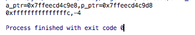

# 指针和数组的爱恨情仇

指针和数组他们之间没有任何关系  
- 指针就是指针，指针变量在32位系统下，永远占4个byte，其值为某一个内存的地址。指针可以指向任何地方，但是不是任何地方你都能通过这个指针变量访问到。
- 数组就是数组，其大小与元素的类型和个数有关。定义数组时必须指定其元素的类型和个数。数组可以存放任何类型的数据，但不能存函数。  

## 如何分辨数组指针和指针数组  
- 指针数组：首先它是一个数组，数组的元素都是指针，数组占多少个字节由数组本身决定。它是“存储指针的数组”的简称
- 数组指针：首先它是一个指针，他指向一个数组。在32位系统下永远是占4个字节，至于它指向的数组占多少个字节，不知道。它是“指向数组的指针”的简称

考虑下，下面2个哪个是指针数组，哪个是数组指针
```
A). int *p1[10];
B). int (*p2)[10];
```
根据右左法则，先找到未定义标识符，p1右边是[]因为[]比`*`的优先级高，p1先与[]结合，所以它是一个数组。`int *`修饰的是数组的内容。  
再看p2，因为"()"比"[]"优先级高，所以`(*p2)`表示这是一个指针，指针变量名为p2,int修饰的数组内容，即数组的每个元素。数组在这里没有名字，是匿名数组。所以p2是一个数组指针，指向一个包含10个int类型数据的数组。

## 多维数组和多级指针

考虑下面一个例子  
&p[4][2]-&a[4][2]的值为多少
```
#include <stdio.h>
int main()
{
    int a[5][5];
    int (*p)[4];
    p = a;
    printf("a_ptr=%#p,p_ptr=%#p\n",&a[4][2],&p[4][2]);
    printf("%p,%d\n",&p[4][2]-&a[4][2],&p[4][2]-&a[4][2]);
    return 0;
}
```
运行结果如下：  
    
文字解析，不如看图来的好  
  

## 数组参数与指针参数

### 一维数组参数
#### 能否向函数传递一个数组？
考虑以下程序
```
#include <stdio.h>

void fun(char a[10])
{
    char c = a[3];
}

int main(void)
{
    char b[10] = "abcdefg";
    fun(b[10]);
    return 0;
}
```
上面的调用，fun(b[10]);将b[10]这个数组传递到fun函数。这样显然不对。  
b[0]代表是数组的一个元素，那么b[10]也是，只是这里越界了。但在编译阶段，编译器并不会真正计算b[10]的地址并取值，所在在编译阶段不会报错，但是编译器会给出警告：
```
//在我的Mac上编译出现这个
warning: incompatible integer to pointer conversion passing 'char' to parameter of type 'char *'; take the address with & [-Wint-conversion]  
warning: array index 10 is past the end of the array (which contains 10 elements) [-Warray-bounds]
//在作者的电脑上给出的警告是这样的  
warning C4047: 'function' : 'char *' differs in levels of indirection from 'char '
warning C4024: 'fun' : different types for formal and actual parameter 1

```
虽然编译没问题，但运行肯定有问题。  
具体分析如下:  
1. b[10]并不存在，在编译的时候由于没有去实际地址取值，所以没有出错，但是在运行时，将计算b[10]的实际地址，并且取值。这时发生越界错误
2. 编译器的警告已经告诉我们编译器需要的是一个char*类型的参数，而传递过去的是一个char类型的参数，这时候fun函数会将传入的char类型的数据当地址处理，同样会发生错误
3. 对第二个错误的理解，fun函数明明传递的是一个数组啊，编译器怎么会说是char*类型呢？  

将fun(b[10])改为fun(b)，编译后不会出现警告了。

#### 无法向函数传递一个数组
可以简单验证下，代码如下
```
#include <stdio.h>

void fun(char a[10])
{
    int i=sizeof(a);
    printf("i:%d\n",i);
    char c=a[3];
}

int main(void)
{
    char b[10] = "abcdefg";
    int j = sizeof(b);
    printf("j:%d\n",j);
    fun(b);
    return 0;
}
```
  
如果数组b真正传递到函数内部，那么i的值应该为10，但我测试后发现i的值为8(作者测的值为4)。造成这样的原因是这样一条规则:   
- C语言中，当一维数组作为函数参数的时候，编译器总是把它解析成一个指向其首元素首地址的指针

> 这么做是有原因的。在 C 语言中，所有非数组形式的数据实参均以传值形式（对实参
做一份拷贝并传递给被调用的函数，函数不能修改作为实参的实际变量的值，而只能修改
传递给它的那份拷贝）调用。然而，如果要拷贝整个数组，无论在空间上还是在时间上，
其开销都是非常大的。更重要的是，在绝大部分情况下，你其实并不需要整个数组的拷贝，
你只想告诉函数在那一刻对哪个特定的数组感兴趣。这样的话，为了节省时间和空间，提
高程序运行的效率，于是就有了上述的规则。同样的，函数的返回值也不能是一个数组，
而只能是指针。这里要明确的一个概念就是：函数本身是没有类型的，只有函数的返回值
才有类型。很多书都把这点弄错了，甚至出现“XXX 类型的函数”这种说法。简直是荒唐
至极！

所以我们写代码的时候，可以写成这样
```
#include <stdio.h>
void fun(char a[])
{
    char c=a[3];
}

int main(void)
{
    char b[10] = "abcdefg";
    fun(b);
    return 0;
}
```
或者也可以
```
void fun(char *p)
{
    char c=p[3];
}
```
